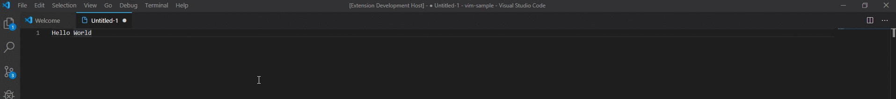
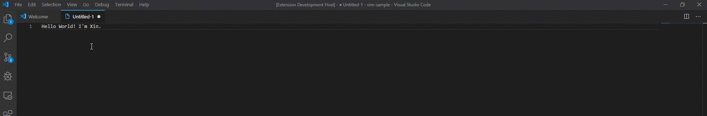
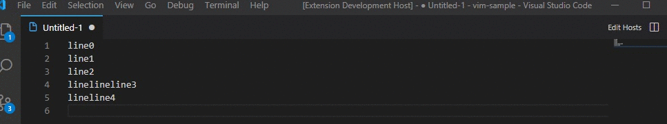

# x-processor-utils

x-processor-utils is a simple VS Code extension, which collects a set of useful document format method together, and provides you with relevant cmd.

## Features

- **Reverse selected document**
 <i>xProcessor: xReverse</i>

- **Make Uppercase/Lowercase selected document**
 <i>xProcessor: xToUpperCase / xProcessor: xToLowerCase </i>

- **Add anything in the ending of every selected lines**
 <i>xProcessor: xAddInLinesEnding</i>

## Requirements

## Extension Settings

## Known Issues

## Release Notes

## Change Log

### 0.0.1

Initial release of basic feature, including: 
- reverse
- to upper/lower case
- add anything in lines ending

